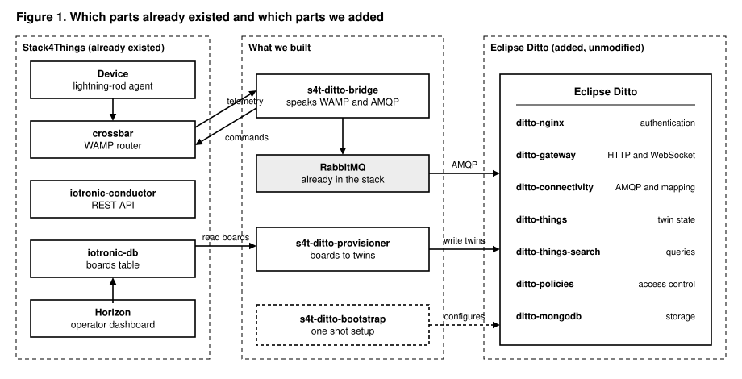
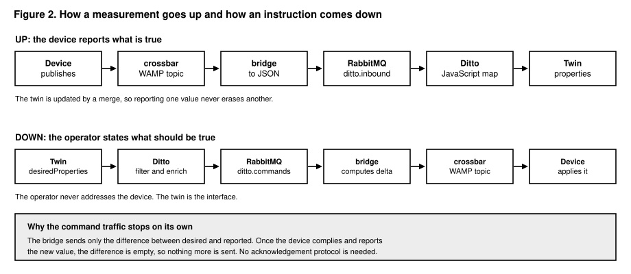
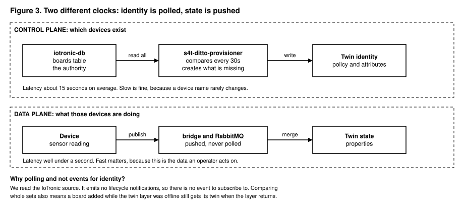
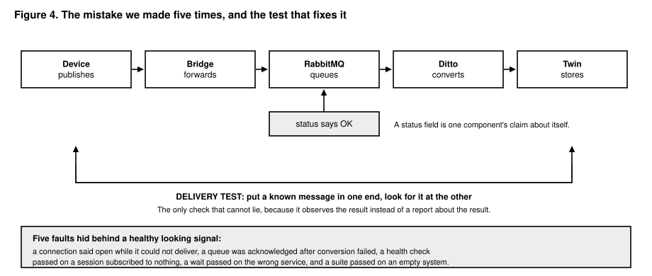

---
output:
  word_document: default
  html_document: default
---
# A Digital Twin Layer for Stack4Things: Evaluation, Design, Implementation and Verification

Author: Mohsen Ghalem
Date: 25 August 2026
Project: Stack4Things


---

## Executive summary

Eclipse Ditto now runs alongside Stack4Things on the same host and the same Docker network. Every board registered through Horizon receives a digital twin automatically within about thirty seconds. Telemetry published by a device on the WAMP bus reaches that twin. An instruction written on the twin reaches the device. All of it runs as containers with no operator terminal open, and all of it is verified by a script that anyone can execute.

No IoTronic image was rebuilt. No existing service definition was edited. No existing volume was touched. The integration is a second Compose file that adds to the first.

The prediction stage, which is the part the original task named explicitly, is designed but not yet built. Section 26 explains what remains and why the remaining work is now straightforward.

Five faults were found and fixed during implementation. Four of them shared a single shape, described in section 23, and that pattern is the most transferable result of the work so far.

---

# Part I. Background and evaluation

## 1. The task

The assignment was to explore digital twins solutions that can be a good fit with Stack4Things, we found the best match is Eclipse Ditto, then build on top of it a customisable data pipeline able to collect and predict data events from physical devices.

Two questions had to be answered before any code was written. Is Ditto worth adding to Stack4Things at all, and if so, where exactly is the boundary between the two systems. Part I answers the first. Part II answers the second.

## 2. What a digital twin is in this context

A digital twin is a software object representing one physical device. It holds what the device last reported and what an operator wants the device to do. Applications talk to the twin rather than to the device.

The reason this matters is availability. A machine on a factory floor may be busy, asleep, behind a NAT, or switched off. The twin is always present, so a dashboard, a report or a prediction model can read current state without waiting for the device to answer. The twin also outlives any single connection, which is what makes an instruction survive a device being offline.

## 3. What Ditto is, and what it is not

Ditto is a framework for managing the state of digital twins. It stores twin state, controls access to it, makes it searchable, and streams changes to subscribers.

It is not a device management system. It does not provision devices, install software on them, manage plugin lifecycles, or tunnel through NAT. Those are exactly the things IoTronic already does well, which is why the boundary between the two turns out to be unusually clean.

It is also not an analytics platform. It stores and serves state. Any prediction has to be written separately, which is the subject of Stage D.

## 4. The domain model

Four entities carry the whole model.

**Thing.** The twin itself, identified as `namespace:name`, for example `s4t:65f0bbf4-37cb-47d3-84cb-1d7902e7c1ad`. It carries an immutable `thingId`, a `policyId` naming which policy governs access, an optional semantic `definition`, an `attributes` block for static or slowly changing metadata such as location, model and fleet, and a `features` block for dynamic state. System fields include `_revision`, which is genuinely monotonic because Ditto is event sourced.

The split between attributes and features is a real modelling decision rather than cosmetics. Attributes describe what the thing is. Features describe what it is currently doing. Search and authorization both work naturally across that split.

**Feature.** A named block of dynamic state. Each feature carries `properties`, being the state as last reported by the device, and `desiredProperties`, being the state an operator wants the device to reach. The device is authoritative over the first. The operator is authoritative over the second.

That pair is the reported versus desired reconciliation pattern, built in. An operator writes a desired value, the change is delivered downstream, the device eventually reports a matching value, and the two converge. Ditto persists the desire in the meantime, so it survives both the device being offline and Ditto being restarted.

A thing may have any number of features. This matters more than it first sounds. Separating `telemetry`, `prediction` and `health` into three features allows a policy to grant read access on one and deny it on another, within the same twin, with no application level filtering.

**Policy.** Authorization as an independently stored entity rather than a field on the thing. A policy contains entries. Each entry names subjects, which are prefixed by their issuer so identities from different authentication sources coexist, resources addressed as JSON paths into the entity, and grants or revokes of READ and WRITE at those paths.

Two properties make policies more powerful than they first appear. Revoke beats grant, so granting read on `thing:/` and revoking it on one nested path expresses "everything except the sensitive part" natively. And policy imports allow one policy to reference entries from another, where referenced revokes can never be stripped by the importing policy. That rule is what makes delegated administration safe: a site administrator can extend a root policy but cannot widen it past the root's prohibitions.

One policy can govern thousands of things, which is how per fleet or per tenant access control is expressed without writing a policy per device.

**Metadata.** Arbitrary metadata attachable at any JSON path and stored alongside the value, typically a measurement timestamp or a unit. It is written with the modifying command rather than as a separate call.

## 5. Signals, channels and the protocol

Every interaction with Ditto, over any transport, is one of a small set of signal types: command, command response, error response, event, message and announcement. The uniformity is the point. The HTTP API, the WebSocket, the SSE stream and every broker connection use the same signal model, so adding a transport does not add semantics.

The same command can be addressed to one of two channels. The `twin` channel operates on the persisted twin, so a read returns last known state immediately whether or not the device is reachable. The `live` channel routes to the real device, which is responsible for producing the response, and nothing is persisted. The practical rule is to use `live` when ground truth or immediate actuation is required and the device being unreachable is acceptable, and `twin` for everything else. Both are authorized by the same policy, so switching channel does not switch security model.

The Ditto Protocol is a JSON envelope expressing any signal independently of transport:

```json
{
  "topic": "s4t/65f0bbf4-.../things/twin/commands/merge",
  "path": "/features/telemetry/properties",
  "value": { "temperature": 22.4 },
  "headers": {
    "content-type": "application/merge-patch+json",
    "response-required": false
  }
}
```

Four modification actions exist and choosing correctly matters. `create` and `modify` replace the addressed element wholesale. `merge` applies an RFC 7396 JSON merge patch, so only the supplied keys change and `null` deletes a key. `retrieve` reads and `delete` removes.

For device telemetry, `merge` is almost always correct. A board reporting only its temperature must not erase `fan_on`. This choice has a consequence that caused a total outage of the inbound path during implementation, described in section 23.

Three refinements make change subscriptions usable at scale. RQL filters let Ditto decide what to send rather than every consumer discarding most of what it receives. Signal enrichment attaches fields of the twin that did not change to the event that did, removing the read back round trip a naive consumer would otherwise make on every message. Conditional requests allow a write to apply only if the twin is in an expected state, which is optimistic concurrency without a hand rolled version column.

## 6. Capability survey

| Capability | What it provides |
|---|---|
| HTTP API | Full CRUD on things, features, policies and connections, with `PATCH` using `application/merge-patch+json` |
| WebSocket | Bidirectional Ditto Protocol on one socket |
| Server Sent Events | One way change stream, consumable from a browser, supporting RQL filter and enrichment |
| Search | RQL query across all twins the caller may read, with cursor paging and sorting |
| History | Event sourced storage makes historical revisions retrievable and streamable, bounded by revision or timestamp |
| Connectivity | Managed connections to AMQP 0.9.1, AMQP 1.0, MQTT, Kafka, HTTP and Eclipse Hono, with sources, targets, failover and per connection metrics |
| Payload mapping | A JavaScript function per connection converting arbitrary device payloads to and from Ditto Protocol |
| Acknowledgements | Requestable acknowledgements and end to end delivery guarantees with redelivery |
| Messages | Arbitrary payloads routed through Ditto to a device inbox or from its outbox, not persisted |
| WoT integration | Reference a W3C Thing Model, generate a per instance Thing Description, and validate modifications against the model |
| Explorer UI | Bundled web interface to browse, search and edit twins, manage policies and connections, and watch events live |
| DevOps commands | Manage connections and retrieve config or logs at runtime, plus per connection metrics and logs |

The connectivity binding and the payload mapping are the two capabilities this integration depends on most. The per connection logs turned out to be the single most valuable diagnostic tool in the whole project, for reasons section 23 explains.

## 7. Architecture and internals

Ditto is five microservices in one Apache Pekko cluster. Policies persists policies and makes authorization decisions. Things persists things and features and enforces authorization on them. Things-Search maintains the search index and executes queries. Gateway terminates the HTTP and WebSocket APIs and authenticates callers. Connectivity persists and runs connections, translating to and from external brokers and running payload mappings.

Each service owns its own data store, no other service may touch it, each exposes its API purely as signals, and all inter service interaction goes through those signals. They communicate over Pekko remoting via TCP without an intermediate broker, which keeps internal latency low.

Things and policies are persisted as an append only stream of events with periodic snapshots rather than as mutable rows. Three consequences are worth understanding before adopting it. Every change is recoverable and `_revision` is a genuine monotonic version, which is where the history capability comes from essentially free. Storage grows with change rate rather than entity count, so a board reporting once per second generates far more journal than one reporting hourly and retention must be configured deliberately. Ordering per entity is guaranteed, ordering across entities is not.

MongoDB backs all services. The documented minimum is two CPU cores and 4 GB of RAM available to Docker, exclusive of anything else on the host.

## 8. Baseline: what Stack4Things had

For the evaluation to be honest the baseline has to be stated. The running deployment provides `iotronic-conductor` on port 8812 as the REST API owning the `boards` table, `iotronic-db` as MariaDB 11 holding all persistent state, `crossbar` on 8181 as a TLS only WAMP router in realm `s4t`, `iotronic-wagent` bridging AMQP to WAMP, `lightning-rod` as the board side agent, `iotronic-wstun` for NAT traversal, `keystone` for OpenStack identity, `rabbitmq`, and `iotronic-ui` as the Horizon dashboard.

What was absent: any queryable representation of device state as opposed to device identity, any history of how state evolved, any authorization granularity finer than the OpenStack policy file, any event stream an application could subscribe to, and any prediction or anomaly detection.

## 9. The case for adopting Ditto

**It fills a layer that is genuinely empty.** The target architecture names a Data layer and a Frontend layer. An application wanting to know a board's temperature had no supported way to ask. Ditto answers that with an API rather than a convention.

**Cross factory search is a query problem.** The multi factory domain calls for a view spanning sites, which means questions like "every board in fleet X above 70 degrees". Things-Search with RQL answers that directly. Building an equivalent over MariaDB means indexing JSON columns and writing a query language, which is a project in itself.

**Distributed trust needs an immutable record.** The architecture anticipates a DLT component holding immutable metadata and audit trails. Event sourcing produces exactly that record as a byproduct, with configurable retention and a streaming API. It is the natural place to anchor a future DLT integration by hashing the event stream rather than inventing a separate audit path.

**Worker data needs per path authorization.** This is the Operator 5.0 requirement with the sharpest technical consequence. A twin may hold both machine telemetry and worker adjacent data. Policies grant and revoke on individual JSON paths with revoke beating grant, which expresses "everything except this subtree" natively. Doing this in application code means every consumer is a place the filtering can be forgotten.

**MongoDB was already in the target architecture.** Ditto brings it in as the storage engine of a component that needs it rather than as a container added ahead of a use case.

**It does not collide with IoTronic.** Every one of IoTronic's strengths, being provisioning, code injection, plugin lifecycle, tunnelling and WAMP transport, is something Ditto does not do and should not be given.

**It is standard, and that has research value.** Ditto is an Eclipse Foundation project under EPL-2.0, actively released. Prior art exists to position against: OpenTwins composes Ditto with Kafka-ML, InfluxDB, Grafana and Unity on Kubernetes. That validates the shape of the approach and also defines the gap, since OpenTwins assumes cloud resident Kafka and a Kubernetes operator whereas the contribution available here is an IoTronic native pipeline with device side code injection and fog tier offline resilience.

## 10. The case against

Stated at full strength, because a proposal that argues one side is not an evaluation.

**Ditto contributes nothing to prediction.** This is the most important caveat and the easiest to lose sight of. Consuming telemetry, windowing it, running a model and emitting a forecast could be built directly against the WAMP bus in a few hundred lines with no new containers. Ditto is the substrate, not the mechanism. Any write up claiming the integration itself as the contribution is weak. The contribution is the declarative pipeline and its behaviour under fog tier disconnection.

**Seven more containers on a production instance.** Five Ditto services plus MongoDB and nginx, on a deployment whose data volumes must not be recreated and which already runs eleven containers.

**A 4 GB floor before anything else.** That is the documented minimum for Docker, exclusive of the existing stack. On a laptop class host this may simply not fit. It is an empirical question that should be answered before committing.

**Real learning cost.** Protocol topics, the twin and live distinction, policy imports, connection sources and targets, payload mapping and RQL. That is time not spent on the prediction work, which is the part with actual novelty.

**Storage grows with change rate.** A fleet reporting at 1 Hz generates journal volume requiring retention tuning. Manageable, but discovered in month three rather than week one.

**Operational security is not free.** The stock deployment fronts Ditto with nginx doing basic authentication against a demo credential file. That must be changed before anything is reachable, and mapping Keystone identity onto Ditto subjects is a design task of its own.

**Ditto does not fix the bus underneath it.** Crossbar currently accepts anonymous WAMP connections with wildcard permissions, a known and intentionally deferred issue. Adding a well authorized twin layer above an open bus improves the API story without improving the actual security posture, and that should be named honestly rather than implied away.

## 11. Verdict

Adopt, with a staged commitment and one deliberate design constraint.

The decisive test is not whether Ditto does useful things, because it plainly does. It is whether Stack4Things needs capabilities it should not build itself. Three of the four target architecture domains do: cross factory search, immutable history for distributed trust, and per path authorization for worker data. None of those is a weekend's work, and each done badly in house becomes permanent technical debt.

Two conditions attach to that verdict. First, answer the resource question empirically before anything else, because if seven more containers do not fit on the host the rest of the plan is academic. Second, do not marry the prediction pipeline to Ditto. Its logic is substrate agnostic by nature, so Ditto Protocol types should stay out of the model code behind a thin adapter. That costs almost nothing up front and is very expensive to retrofit.

Both conditions were honoured. The resource measurement is recorded in section 18. The predictor design in section 26 keeps the model code free of Ditto types.

---

# Part II. Design

## 12. Principle: alongside, not inside

Ditto is deployed as a separate Compose overlay joined to the existing `s4t` network, communicating with Stack4Things through exactly one new component and one existing broker.

This is not only caution. Patching functionality into `iotronic-conductor` would require rebuilding an image whose source is not in this repository, and the bind mounted configuration exposes only `.conf` and policy files. Any design depending on modifying that image is a design that stalls. Routing everything over RabbitMQ, which Ditto speaks natively and which is already running, avoids the problem entirely.

## 13. Architecture of the integration



*Figure 1. Which parts already existed and which parts were added.*

Three programs were written.

**The bridge**, `scripts/s4t_ditto_bridge.py`, is the only component that speaks both languages. Stack4Things communicates over WAMP, a publish and subscribe protocol over websockets. Ditto communicates over AMQP. Neither understands the other. The bridge subscribes to WAMP, publishes to AMQP, and does the same in reverse.

Inbound the bridge is deliberately dumb. It receives a telemetry event, serialises it to JSON and publishes it. It does not build Ditto Protocol messages and does not know what a thing is. All reshaping happens in the JavaScript payload mapping attached to the connection, which means the device wire format can change without redeploying the bridge.

Outbound it has to be less dumb, because it must decide whether a command is worth sending at all. That decision is described in section 15.

**The provisioner**, `scripts/s4t_ditto_provisioner.py`, keeps the set of twins matching the set of boards. It reads the `boards` table, asks Ditto which twins exist, and reconciles the difference.

**The bootstrap**, `scripts/s4t_ditto_bootstrap.py`, runs once at startup. It creates the access policy and the AMQP connection inside Ditto, verifies them, and exits. If it fails, neither the bridge nor the provisioner starts. This is deliberate: it is better for the system to refuse to start than to run against a Ditto that is not configured.

## 14. The twin model

Every board becomes a thing in namespace `s4t` whose name is the board UUID, so `s4t:65f0bbf4-37cb-47d3-84cb-1d7902e7c1ad`. All twins share one policy, `s4t:fleet-unime-lab`, which grants READ and WRITE on `thing:/`, `policy:/` and `message:/` to the subject `nginx:s4t`.

That subject string is worth attention. The basic auth user configured in `conf_ditto/nginx.htpasswd` is seen by Ditto as `nginx:<username>`. Getting it wrong produces a 403 on twins with a cause several steps removed from the symptom.

Board derived metadata lives in `attributes`: `boardName`, `boardType`, `fleet`, `status`, `owner`, `project`, `mobile`, `lrVersion`, `extra` and `provisioning`. The provisioner owns exactly those keys and never touches anything else, which is what protects `attributes/pipeline` and anything a user adds by hand.

Dynamic state lives in features, with `telemetry` carrying the device reported values under `properties` and any operator intent under `desiredProperties`.

## 15. How data moves



*Figure 2. How a measurement goes up and how an instruction comes down.*

Going up, the device publishes a WAMP event on `s4t.telemetry.<uuid>.report`. Crossbar routes it to the bridge, which subscribes with the wildcard pattern `s4t.telemetry..report`. The bridge builds a small JSON object carrying `board_uuid`, `state` and `ts`, and publishes it to RabbitMQ's default exchange with the routing key `ditto.inbound`, which delivers straight to that queue. Ditto's connection source consumes the queue and runs the JavaScript mapping, which converts the JSON into a merge command. The Things service applies it at `/features/telemetry/properties`.

The wildcard pattern deserves a note. A WAMP wildcard must have the same number of components as the topics it matches, with empty strings in the wildcard positions. `s4t.telemetry..report` has four components and matches `s4t.telemetry.<uuid>.report` but not `s4t.command.<uuid>.apply`, so the subscription can never be woken by the bridge's own outbound publications.

Going down, an operator writes a desired property on the twin. Ditto's outbound target filters on `exists(features/telemetry/desiredProperties)` and enriches the event with `features/telemetry/properties` so the reported state travels with it. The event is published to the `ditto` exchange with routing key `outbound`, bound to the queue `ditto.commands`. The bridge consumes it, compares desired against reported, and publishes only the difference on `s4t.command.<uuid>.apply`.

Comparing rather than forwarding gives convergence for free. Forwarding the desired state wholesale would emit a command on every telemetry report for as long as a desire is set, forever, including long after the device complied. Comparing is self terminating: the device complies, reports the new value, the next event produces an empty difference, and the traffic stops. No acknowledgement protocol and no bookkeeping are required.

## 16. Two clocks: identity is polled, state is pushed



*Figure 3. Identity is refreshed by polling. State arrives as events.*

The set of devices is refreshed by polling every thirty seconds. The state of those devices arrives immediately as events. That looks inconsistent, and the reason is worth stating precisely.

There is no event to subscribe to. The IoTronic source inside the running container contains the standard oslo messaging boilerplate but no notification objects, so IoTronic never announces that a board was created or deleted. This was verified by inspection rather than assumed.

Once that was established, polling turned out to be the better design for an unrelated reason. The provisioner compares the full set of boards against the full set of twins on every pass and does not track what changed. A board registered while the twin layer was switched off still receives its twin when the layer returns. An event driven design would have missed it permanently.

The difference in latency is also appropriate to the data. A device name changes rarely, so fifteen seconds of average delay costs nothing. A temperature reading is what an operator acts on, so it arrives in well under a second.

## 17. The connection

One Ditto connection of type `amqp-091` carries everything. It has one source and two targets.

| Direction | Address | Purpose |
|---|---|---|
| source | `ditto.inbound` | Telemetry and, later, prediction write backs into Ditto, through the JavaScript mapping |
| target | `ditto/outbound` | Desired state changes out to devices, enriched with reported state so the bridge can compute a difference |
| target | `ditto.events/twin.events` | Change events for the predictor, enriched with `attributes/pipeline` so it receives its configuration in band |

The two targets sit on two different exchanges, and that is mandatory rather than stylistic. Ditto's RabbitMQ publisher collects a connection's targets into a map keyed by exchange name, so two targets sharing an exchange raise a duplicate key error on every channel open. Section 23 records what that looked like in practice.

The AMQP URI encodes the virtual host explicitly as `%2F`. A bare trailing slash after the port means the empty virtual host rather than the default one, and RabbitMQ rejects it.

The inbound mapping is a short JavaScript function:

```javascript
function mapToDittoProtocolMsg(headers, textPayload, bytePayload, contentType) {
    var p = JSON.parse(textPayload);
    if (!p.board_uuid || !p.state) { return null; }
    return Ditto.buildDittoProtocolMsg(
        's4t', p.board_uuid, 'things', 'twin', 'commands', 'merge',
        '/features/telemetry/properties',
        { 'response-required': false,
          'content-type': 'application/merge-patch+json' },
        p.state
    );
}
```

The `content-type` header is mandatory. Ditto validates it against RFC 7396 and rejects a merge without it. Omitting it broke the entire inbound path silently for the whole of Phase 1.

---

# Part III. Implementation

## 18. Stage A: Ditto, declarative and persistent

Goal: bringing up both Compose files together starts Stack4Things and Ditto, twins survive a `down` and a subsequent `up`, and nothing depends on a directory outside the repository.

Deliberate differences from the upstream Ditto deployment:

| Upstream | Here | Why |
|---|---|---|
| No MongoDB volume | Named volume `ditto_mongodb_data` | A `down` destroyed every twin |
| Publishes 27017 and 8081 | Neither published | Unnecessary exposure on a factory server |
| Demo credentials `ditto`/`ditto` and `devops`/`foobar` | Generated, read from `.env` | The demo values are published in a public repository |
| Service names `things`, `gateway`, `nginx` | Prefixed `ditto-*` | The network is shared with Stack4Things |
| `restart: always` | `restart: unless-stopped` | Allows a service to be stopped deliberately |
| Log size limit only | `max-size` and `max-file` | Rotation rather than truncation |
| Fixed memory limits | Variables in `.env` | Tunable per host |
| Ships Swagger UI | Dropped | Unused, and its nginx location blocked startup |
| Clone of the Ditto repository | Vendored `conf_ditto/` | The repository is self contained and reproducible |

Two details are load bearing. Every Java service carries the `ditto-cluster` network alias, which Pekko uses for seed node discovery; removing it means the cluster never forms, which presents as services restarting for no visible reason. And `ditto-connectivity` deliberately omits `ExitOnOutOfMemoryError` from its JVM options, because the AMQP client can throw spuriously and exiting on it puts the service in a restart loop.

Measured resource profile on the development host: 19 containers, five cluster members up, roughly 2.33 GB of Ditto memory against 3.0 GB of configured limits, on a Docker allocation of 12 CPUs and 8.22 GB. Time to healthy is about two minutes, most of which the JVMs genuinely need.

That measurement answers the first condition attached to the verdict in section 11. Seven more containers do fit.

## 19. Stage B: the bootstrap container

A one shot container creates the policy and the connection idempotently, verifies them, and exits. It is gated by `restart: "no"` and by `condition: service_completed_successfully` on its dependants.

One API detail cost real time and is worth recording. The three routes to creating a connection do not behave alike. `POST /api/2/connections` creates but Ditto generates the identifier and rejects an explicit one with `connectivity:id.notsettable`. `PUT /api/2/connections/{id}` modifies only, and the documentation is explicit that the connection must already exist. Only the piggyback command `connectivity.commands:createConnection` accepts a full connection object including an explicit identifier. The bootstrap therefore attempts a GET, modifies with PUT when the connection exists, and falls back to the piggyback command when it does not.

The bootstrap waits for Ditto before touching anything, and what it waits for changed after a failure. Waiting for the gateway to answer `/status` is not sufficient, because connection calls are routed to the connectivity service, and a gateway that is up will accept a request it has nobody to hand to. It now waits for `GET /api/2/connections` to return 200, which proves connectivity is genuinely reachable.

## 20. Stage C: the bridge and the provisioner

Both run as long lived containers with health that means connected and working rather than merely running.

Neither service exposes an HTTP endpoint, so a healthcheck could only prove the process exists, which is close to useless: the bridge can run happily with a dropped WAMP session while forwarding nothing. Each therefore touches a file, and only while genuinely working. The bridge touches it when the WAMP session, the subscription and the AMQP channel are all live, within a twenty second window. The provisioner touches it after a reconciliation pass completes with zero failures, within a hundred and twenty second window. The healthcheck tests the file's age.

The subscription is part of that condition because of a fault described in section 23, where a perfectly good WAMP session was subscribed to nothing and reported itself healthy.

Startup order is enforced by Compose conditions. The bootstrap must complete successfully. The bridge additionally waits on Crossbar and RabbitMQ being healthy. The provisioner additionally waits on the database and on Things-Search, because it reconciles by searching.

Crossbar has no healthcheck in the base Compose file, so nothing could wait on it. The overlay adds one without editing that file, using the same Python socket probe `iotronic-wagent` already uses. Compose merges service definitions across files, so this is purely additive.

The provisioner has four safety properties worth stating. Updates never touch `features`, so live telemetry, predictions and desired properties are never clobbered. Updates never touch `attributes/pipeline`, so a pipeline descriptor edited by hand survives every sync. Creation uses `If-None-Match: *`, so if a board reports telemetry at the same moment the provisioner runs, the PUT fails with 412 rather than overwriting the twin. Updates send `if-equal: skip`, so an unchanged board produces no new revision and no change event, which matters because otherwise every poll cycle would emit an event per board for the predictor to filter out.

Removal defaults to marking a twin orphaned rather than deleting it, because deleting destroys its event sourced history.

## 21. Configuration reference

**WAMP topics.** Telemetry on `s4t.telemetry.<uuid>.report`, commands on `s4t.command.<uuid>.apply`, both with four dot separated components so a wildcard subscription is unambiguous.

**AMQP topology**, declared by the bootstrap because Ditto declares neither queues nor exchanges:

| Object | Type | Bound to |
|---|---|---|
| `ditto.inbound` | queue | default exchange, by routing key |
| `ditto` | direct exchange | |
| `ditto.commands` | queue | exchange `ditto`, key `outbound` |
| `ditto.events` | direct exchange | |
| `ditto.twin.events` | queue | exchange `ditto.events`, key `twin.events` |

**Credentials.** Three separate authentication contexts, which is a common source of confusion:

| Path | Credential |
|---|---|
| `/status`, `/health` | none |
| `/api/2/things`, `/api/2/policies`, `/ws/2`, Explorer UI | basic auth as `s4t` with `DITTO_API_PASSWORD` |
| `/api/2/connections`, `/devops` | `devops` with `DITTO_DEVOPS_PASSWORD` |

Ditto sees the basic auth caller as the subject `nginx:s4t`. The password itself lives in `conf_ditto/nginx.htpasswd` as an apr1 hash, because nginx reads a file; `.env` records the username so the bootstrap and provisioner know which subject to grant.

**Environment.** Ditto is pinned to a specific version rather than `latest`, because a re-pull silently changes what was measured. The external port is 8090 rather than 8080, because 8080 on this host is `iotronic-wstun`. Memory limits for each service are variables so they can be tuned per host.

---

# Part IV. Verification

## 22. Why status fields were not trusted



*Figure 4. Measuring next to the truth, and the delivery test that fixes it.*

Four separate components reported themselves as working while failing. The pattern is always the same: something adjacent to the truth is measured and treated as the truth. A status field is one component's claim about itself. It is not evidence that a message arrived.

The only check that cannot mislead is one that puts a known message in at one end and looks for it at the other.

## 23. The five faults

| What was checked | What it reported | What was actually true |
|---|---|---|
| Keystone wrote a marker file | Startup finished | The API was not listening yet, so the service catalog was empty |
| The Ditto gateway answered `/status` | Ditto was ready | The connectivity service had not joined the cluster, so the call hung until it timed out |
| The bridge held a WAMP session | The bridge was working | Its subscription had failed, so it received nothing and still reported healthy |
| The connection reported `liveStatus: open` | Messages were flowing | Its publisher was crash looping and had never delivered anything |
| RabbitMQ received an acknowledgement | The message was processed | Ditto acknowledged messages whose conversion had failed, and discarded them |

Three of these deserve detail.

**The subscription that was not.** The bridge passed a plain dictionary as subscription options. Autobahn asserts that options must be a `SubscribeOptions` instance, so the call raised a bare `AssertionError` inside the join callback. Autobahn logged it and carried on. The result was a healthy WAMP session subscribed to nothing, an AMQP connection that stayed up, and heartbeats that kept flowing, so the container reported healthy while being completely deaf. That is precisely the failure the heartbeat existed to prevent, and it walked straight through it. Health now requires the subscription, and a failed subscribe leaves the session deliberately rather than lingering.

**The connection that was open and could not deliver.** Two outbound targets were configured on the same exchange, distinguished only by routing key. That is valid AMQP and rejected by Ditto, whose publisher collects targets into a map keyed by exchange name. Every channel open threw a duplicate key error, the supervisor restarted the channel actor, and the cycle repeated thousands of times per second. Throughout, the connection's `liveStatus` read `open`, and a stage had already been signed off on that word. The crash loop was also the true cause of a Docker CPU usage figure above 330 percent that had been attributed to something else.

**The queue that acknowledged what it discarded.** After the mapping failed with HTTP 415, Ditto still sent `basic.ack` to RabbitMQ. Every rejected telemetry message was permanently removed from the queue as though processed. Because the mapping set `response-required: false`, the error response was dropped too, so nothing surfaced anywhere except a log category that is disabled by default. Given that offline resilience is a stated goal of this project, a queue silently discarding what it cannot process is an architectural problem rather than a typo, and a dead letter exchange on `ditto.inbound` is now a required item for Stage E.

The underlying fix for that last one was a single header. Ditto requires `content-type: application/merge-patch+json` on a merge command. Without it the command is rejected before reaching the Things service. The inbound path had been broken since Phase 1 and nothing measured it until a test was written that did.

## 24. The verification suite

`scripts/verify_stage_c.sh` runs thirteen checks and exits non zero if any fail.

```
1. The three containers
  PASS  s4t-ditto-bootstrap exited 0
  PASS  s4t-ditto-bridge is healthy
  PASS  s4t-ditto-provisioner is healthy
2. The bridge is attached to both buses
  PASS  AMQP inbound queue declared
  PASS  AMQP outbound exchange bound
  PASS  WAMP session joined and subscribed
3. The provisioner is reconciling
  PASS  reconciliation running: created=0 unchanged=2 failed=0
  PASS  last pass had failed=0
  PASS  no update churn on an idle system
4. Twins match boards
  PASS  2 twin(s) for 2 board(s)
5. Regression guard: the publisher is not crash-looping
  PASS  no 'Duplicate key' in the last 5 minutes
6. DELIVERY, outbound
  PASS  twin change traversed Ditto -> RabbitMQ -> bridge -> WAMP
7. DELIVERY, inbound
  PASS  mock board telemetry reached twin s4t:65f0bbf4-...

  13 passed, 0 failed, 0 proved nothing
```

Checks six and seven read no status at all. Check six creates a temporary twin, writes a desired property on it, and watches for the probe's name arriving in the bridge log, which proves the whole outbound chain. Check seven runs a simulated device and compares the twin's telemetry before and after. These two are the only checks in the suite that could not have passed while the system was broken.

The suite has a third verdict besides pass and fail. On an early run it reported twelve passes against a system with no boards in it, including "0 twins for 0 boards", which is true and worthless. Those now report as `VOID`, meaning the check ran, did not fail, and gathered no evidence, and the suite refuses to declare success while any check is in that state. An empty system passes almost any test.

Check five exists purely as a regression guard, so the duplicate exchange fault cannot return unnoticed.

## 25. Simulating a device

`scripts/s4t_mock_board.py` stands in for a physical board. It publishes the same WAMP topics a real board would, so nothing downstream can tell the difference.

Its design is one shared dictionary. The publishing loop reads it and the command handler writes to it. Each cycle nudges the temperature by a bounded random amount, optionally injects a fault spike every Nth report, publishes `board_uuid`, `state` and `ts`, and sleeps. When a command arrives the handler updates the same dictionary.

That is what closes the loop. Writing `fan_on: true` as a desired property makes the bridge compute a difference and publish it. The board applies it to the shared dictionary, so the next report carries the new value, which travels back up and becomes the twin's reported value. The bridge then computes an empty difference and stops. The device never acknowledges anything. It reports the truth, and the truth changed.

`scripts/demo.sh` drives a narrated demonstration across two terminals, with the device visible on screen throughout, and finishes by running the verification suite live.


