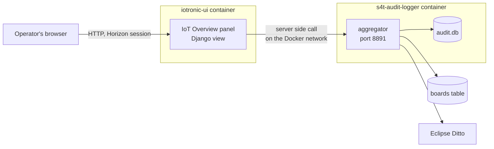
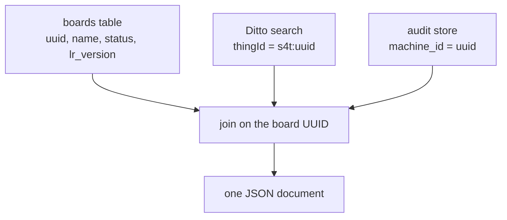

---
output:
  word_document: default
  html_document: default
---

# The IoT Overview Dashboard: How It Was Built and How to Configure It

Author: Mohsen Ghalem
Date: 17 September 2026
Project: Stack4Things, Industry 5.0 extension work

---

## 1. What it is

The IoT Overview is a page inside Horizon, in the IoT section of the sidebar, above Boards. It shows every registered board together with its digital twin and its audit history, on one screen.

Before this page existed, that information was spread across three places and nobody could see all of it at once.

| Where it lived | What it knew |
|---|---|
| The `boards` table in the device registry | That a board exists, whether an agent has connected, and its current status |
| Eclipse Ditto | What the device last reported, and what an operator wants it to do |
| The audit logger | Who acted on the machine, what they did, and when |

The dashboard does not add new data. It joins what already exists and puts it in front of a person.

## 2. What it shows

The page has three parts.

**Summary cards.** The number of boards, how many are online now, how many have ever had an agent connect, how many have a twin, and the total number of audit records.

**The board table.** One row per board with its status, agent version, twin revision, last reported values, how old those values are, the last action taken on it, who took it, and how many audit records it has.

**The paths panel.** Four rows showing when each part of the system last delivered something. This answers the useful question, which is whether data is flowing, rather than whether a process happens to be running.

Clicking a board opens a dialog with its twin properties and its live activity, described in section 7.

## 3. The shape of it



**Figure 1. Two pieces, and who talks to whom.**

There are only two new pieces of software. An aggregator, which lives inside the audit logger service and joins the three sources. A Horizon panel, which asks the aggregator for that joined data and draws it.

## 4. Why the browser never talks to the data sources

This is the decision that shaped everything else.

A web page could call the registry, Ditto and the audit API directly from JavaScript. That would be simpler to write, and it would require putting the Ditto password and the audit token into the page source, where anyone who opens the page can read them.

So the aggregator does all three reads on the server, holds the credentials itself, and returns one document that contains no secrets. The Horizon panel then calls the aggregator from inside its own container, not from the browser.

This choice pays for itself three times over.

**No credentials reach the browser.** Nothing secret is ever sent to a client.

**No cross origin configuration.** The browser only ever calls Horizon, on the same address it is already using.

**It works from any machine.** Because the call to the aggregator happens server side, the dashboard works from any browser that can reach Horizon. An earlier design used a page served on the Docker host, which only worked if you were sitting at that host.

The aggregator's port is not published to the host at all. Its only client is the Horizon container, which is on the same Docker network. A port that exists only inside the network is a much smaller exposure than one bound to the host.

## 5. How the three sources are joined



**Figure 2. One shared key.**

The join is easy because all three systems already use the same identifier. The board UUID in the registry is the name half of the twin identifier in Ditto, and it is the `machine_id` column in the audit store. No mapping table is needed and no normalising is done.

Two rules were applied to the join and both matter.

**Every board appears, even without a twin or history.** A board whose twin is missing is one of the most important things this screen can tell you. Dropping it from the table would turn a visible problem into an invisible one.

**A missing timestamp gives no verdict.** When there is no timestamp to judge by, the age column says "unknown" rather than claiming the data is fresh. Saying fresh on the basis of no evidence would be a quiet lie.

## 6. How the panel gets into the sidebar

Horizon builds its menu from small registration files. Adding a panel means putting two things in the right places inside the `iotronic-ui` container.

| What | Where it goes |
|---|---|
| The panel code | `/usr/local/lib/python2.7/dist-packages/iotronic_ui/iot/iot_overview/` |
| The registration file | `/usr/share/openstack-dashboard/openstack_dashboard/enabled/_6005_iot_overview_panel.py` |

Both are ordinary directories inside the image, so both can be supplied by a bind mount from the host. No image needs to be rebuilt.

Two details are worth writing down because they are easy to get wrong.

**The number in the filename is the position in the sidebar.** Horizon processes these files in filename order. The existing panels are numbered 6010 for Boards through 6050 for Fleets, and 6000 registers the IoT section itself. Naming this file 6005 puts Overview first in the group. Renaming the file is the entire mechanism for moving it.

**The live code is not in `/opt/build`.** That directory holds the source checkout used when the image was built. The package Python actually imports is the copy in `dist-packages`. Mounting over `/opt/build` looks correct and has no effect at all.

The panel itself is written in Python 2.7, because that is what runs inside the Horizon container. It uses `ugettext_lazy` and the older `url()` style, matching the panels already there.

## 7. The detail dialog

Clicking a board opens a dialog rather than expanding the row.

**Twin properties are shown as one table with three columns:** the property name, the reported value, and the desired value. Reported is what the device says. Desired is what an operator has asked for. Rows where the two disagree are highlighted, because that disagreement is the whole point of a twin and two separate tables would hide it.

**Attributes** appear in their own small table underneath.

**Actions update live.** While the dialog is open it refreshes every three seconds, which is faster than the table behind it, because the dialog is where someone is actually looking. Any record newer than the previous refresh flashes once, so a change arriving while you read is visible instead of quietly replacing what was there.

The actions table shows the time, the action, who did it, the outcome with its status code, the target, and the sequence number. When there is no operator, the actor type is shown in grey instead, so a person and a machine never look the same.

The dialog closes with the X, the Close button, a click on the background, or the Escape key. The refresh timer stops when it closes.

## 8. Live updates without a streaming connection

The audit logger already offers Server Sent Events, and using it here was considered and rejected.

An event stream opened by the browser would go straight to the aggregator, which is a different address from Horizon. That brings back the cross origin problem and, worse, would need the aggregator's credentials in the page. Routing the stream through Django instead runs into response buffering in Apache, which breaks streaming in ways that are tedious to diagnose.

So the page polls. The table refreshes every five seconds and the open dialog every three. Both requests go to Horizon on the same address the page came from, so they use the existing session and need no token of their own.

The table refresh updates individual cells rather than rebuilding the whole table. Rebuilding would work, but it would also throw away anything the browser was in the middle of.

## 9. Files

| File | What it is |
|---|---|
| `scripts/s4t_dashboard.py` | The aggregator. Reads the three sources, joins them, serves the JSON. |
| `scripts/test_dashboard_join.py` | Tests for the join logic, with no database and no network. |
| `panels/iot_overview/panel.py` | Declares the panel and its name in the sidebar. |
| `panels/iot_overview/urls.py` | Three addresses: the page, its data, and one board's detail. |
| `panels/iot_overview/views.py` | Calls the aggregator from the server and renders the page. |
| `panels/iot_overview/templates/iot_overview/index.html` | The page itself, including the dialog. |
| `panels/_6005_iot_overview_panel.py` | The registration file that puts Overview in the sidebar. |
| `docker-compose.ditto.yml` | Settings for the aggregator and the two bind mounts. |
| `docker/ditto-tools/Dockerfile` | One line that copies the aggregator into the image. |

## 10. Configuration

All settings go on the `s4t-audit-logger` service, except the two that belong to the panel.

### The aggregator

| Setting | Default | Meaning |
|---|---|---|
| `DASHBOARD_PORT` | `8891` from the compose file | The port the aggregator listens on. The code itself defaults to off, so removing this line from the compose file switches the dashboard off completely. |
| `DASHBOARD_TIMEOUT` | `6` | Seconds to wait for the registry and for Ditto before giving up on one of them. |
| `DASHBOARD_STALE_SECONDS` | `120` | How old a reading has to be before the age column turns red. |
| `DITTO_URL` | `http://ditto-nginx:80` | Where to read twins from. |
| `DITTO_USER`, `DITTO_PASS` | from `.env` | Ditto credentials. The same ones the provisioner already uses. |
| `DITTO_NAMESPACE` | `s4t` | Which namespace the twins are in. |
| `S4T_DB_HOST`, `S4T_DB_PORT` | `iotronic-db`, `3306` | Where the registry is. |
| `S4T_DB_USER`, `S4T_DB_PASS` | `iotronic`, from `.env` | Registry credentials. A normal application account, not the root account, and used only for reading. |
| `S4T_DB_NAME` | `iotronic` | The database name. |

No new secret is introduced. Every credential here is one the provisioner already had.

### The panel

| Setting | Default | Meaning |
|---|---|---|
| `S4T_DASHBOARD_URL` | `http://s4t-audit-logger:8891` | Where the panel finds the aggregator. |
| `S4T_DASHBOARD_TIMEOUT` | `6` | Seconds the panel waits before showing a warning instead of data. |

### The mounts

```yaml
  iotronic-ui:
    volumes:
      - ./panels/iot_overview:/usr/local/lib/python2.7/dist-packages/iotronic_ui/iot/iot_overview:ro
      - ./panels/_6005_iot_overview_panel.py:/usr/share/openstack-dashboard/openstack_dashboard/enabled/_6005_iot_overview_panel.py:ro
```

Read only is on purpose. Python 2 tries to write compiled files next to the source and carries on quietly when it cannot.

## 11. Installing it

```bash
docker compose -f docker-compose.yml -f docker-compose.ditto.yml build s4t-audit-logger
docker compose -f docker-compose.yml -f docker-compose.ditto.yml up -d --force-recreate s4t-audit-logger
docker compose -f docker-compose.yml -f docker-compose.ditto.yml up -d --force-recreate iotronic-ui
```

The audit logger is rebuilt because the aggregator is copied into its image. The Horizon container is recreated rather than restarted because its mounts changed.

After a change to the panel code, which is mounted and not baked in, a restart is enough:

```bash
docker restart iotronic-ui
```

A change to the page template alone needs nothing but a browser reload.

## 12. Checking that it works

Two checks run as part of the audit logger verification script:

```bash
./scripts/verify_audit_logger.sh
```

**Check 14** asks the aggregator for its data from inside the Horizon container, which is the container that will really be calling it, and counts how many boards came back joined to twin state and to audit history. It reports nothing proven when there are no boards, because an empty table demonstrates nothing.

**Check 15** asks Horizon whether the panel address is routed. A redirect to the login page proves the panel is registered, and no login is needed to see that. It then looks in the Apache error log for render failures, because a failure during rendering happens after routing and a status code alone would not catch it.

To check by hand:

```bash
docker exec iotronic-ui python -c "
import json, urllib2
d = json.load(urllib2.urlopen('http://s4t-audit-logger:8891/data', timeout=8))
print d['totals']
for b in d['boards']:
    print ' ', b['name'], b['status'], b['audit']['count']
"
```

The last place to look when something is wrong is the Horizon error log, which is where a template or view problem appears:

```bash
docker exec iotronic-ui sh -c 'tail -60 /var/log/apache2/error.log'
```

## 13. Removing it

The dashboard is additive and comes out cleanly.

| To remove | Do this |
|---|---|
| The sidebar entry | Delete the two volume lines under `iotronic-ui` and recreate the container |
| The aggregator | Remove `DASHBOARD_PORT` and recreate the audit logger |

Nothing else refers to either one. The audit logger does not depend on the dashboard and will not notice it is gone. The aggregator is imported inside a conditional, so even a broken dashboard module cannot stop the audit service from starting.

## 14. What the dashboard can and cannot tell you

**Online and ever connected are different claims, and are shown separately.** A board's agent version can only be written by software running on the device, so it is good evidence that an agent connected at some point. It says nothing about now. The current state comes from the board status instead. An early version of this page counted agent versions as live agents and reported an offline board as connected.

**Freshness is measured, not assumed.** The age column shows how long ago the twin last changed, and turns red past the configured threshold. When there is no timestamp it says unknown.

**Health means delivery.** The paths panel shows when each part last delivered something rather than whether a process is alive. A container cannot see the health status of its neighbours without being given access to the Docker daemon, which would be a far larger privilege than anything else in this deployment, and delivery is the better question anyway.

**Partial failure is shown, not hidden.** Each of the three reads can fail on its own. If Ditto is unreachable while the registry is fine, the boards still appear and a warning names the source that failed. A dashboard that shows nothing because one source is slow is worse than one that shows most of the picture and says what is missing.

## 15. Limits

The page polls rather than streams, so it is current to within a few seconds and not to the instant.

The board detail loads on demand and shows the most recent one hundred records. It is not a full history browser, and the audit API is the right tool for that.

The panel is supplied by bind mount, which is ideal while developing but means the files must travel with the deployment. Turning it into a small derived image is a short next step and is described in the implementation plan.

## References

- `docs/Audit_API_Reference.md`, the audit API the dashboard reads from
- `docs/Audit_Logger_Student_Report.md`, the service that stores the records
- `scripts/s4t_dashboard.py`, the aggregator
- `scripts/verify_audit_logger.sh`, checks 14 and 15
